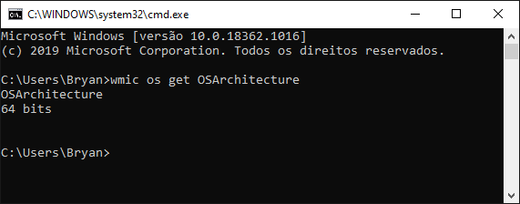
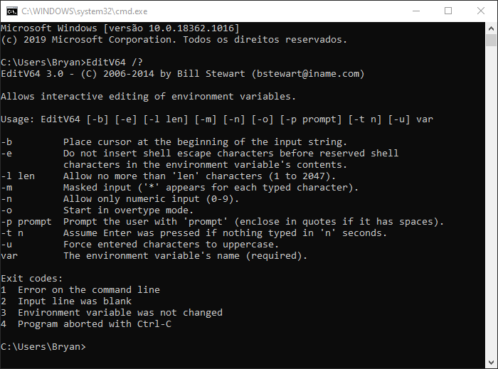

# Mask Text Input in Batch Scripts 

 

Saiba como **mascarar** entradas de texto no prompt de comando do Windows, ideal para senhas ou textos sensíveis à exibição em tela.

Ao mascarar, cada entrada de texto será substituída na tela por um ``*``.

## Menu
- [Recurso](#recurso)
- [32 ou 64 bits?](#32-ou-64-bits)
- [Download](#download)
- [Localização](#localização)
- [Comando e argumentos](#comando-e-argumentos)
- [Créditos](#créditos)
- [Motivação](#motivação)

## Recurso

O prompt de comando do Windows por si só **não oferece** este recurso nativamente, para isso, é necessário recorrer à uma solução externa.

Portanto, para conseguir mascarar a entrada de texto, é necessário a utilização do executável ``EditV32.exe``, nos casos de Windows na versão **32 bits (x86)**, ou ``EditV64.exe``, para Windows na versão **64 bits (x64)**.

## 32 ou 64 bits?

Há várias formas de verificar a versão (_bits_) do SO Windows instalado, como o tema geral deste artigo é sobre scripts batch, irei utilizar o prompt de comando para obter a informação.

Abra o prompt de comando, em seguida digite o comando:

~~~batch
wmic os get OSArchitecture
~~~

A saída do comando na tela exibirá a versão instalada, como na imagem abaixo.

## Download

Após verificar se o sistema instalado é 32 ou 64 bits, baixe este repositório e utilize o programa adequado:
- **[EditV32](EditV32.exe)** *(SO Windows 32 bits)*
- **[EditV64](EditV64.exe)** *(SO Windows 64 bits)*

Caso queira, pode baixar o executável diretamente do site oficial, basta **[clicar aqui.](https://westmesatech.com/?page_id=19)**

## Localização

Após o download do executável compatível com a arquitetura em uso, mova o programa para dentro da pasta **System32**:

~~~
C:\Windows\System32
~~~

:warning: **Atenção! O Windows solicitará a senha de administrador para prosseguir.**

Caso não seja possível autorizar esta ação, você ainda poderá utilizar o executável, no entanto será necessário que ele esteja localizado na mesma pasta em que for executado o script ``*.bat``.

## Comando e argumentos

Para mascarar o input de dados, utiliza-se o seguinte comando e argumentos:

~~~batch
EditVxx -m -p msg variavel
~~~

_**Obs.:** Em ``EditVxx`` substitua "xx" por 32 ou 64, conforme versão do sistema._

| Argumento | Descrição |
|:--------:|:----------|
| -m | Mascara a entrada de caracteres. Exibe ``*`` no lugar dos caracteres digitados. |
| -p msg | Define uma mensagem que aparece no prompt para o usuário. Se tiver espaços ou tabulações, é necessário colocar entre aspas ("). |
| variavel | Nome da variável de ambiente (obrigatório). Pode ser de até 127 caracteres. Caso tenha espaços, deve estar entre aspas ("). |

**IMPORTANTE:** O programa possui outros recursos além de mascarar input de caracteres como: edição do conteúdo da variável de modo interativo, limite de caracteres, restringir entrada apenas a números, entre outros. 

Para consultar este e outros recursos, acesse o **[site oficial](https://westmesatech.com/?page_id=19)**.

No prompt, se utilizar o argumento **``/?``** como o primeiro na linha de comando, exibirá uma mensagem (em inglês) de todos os argumentos e recursos disponíveis do programa.

~~~batch
EditV64 /?
~~~

## Créditos

Os programas ``EditV32`` e ``EditV64`` foram desenvolvidos por **[Bill Stewart](https://www.itprotoday.com/author/Bill-Stewart)**, e podem ser encontrados no site oficial em **[westmesatech.com](https://westmesatech.com/)**.

## Motivação

Este repositório foi criado para finalidade de estudos, bem como disseminar o conhecimento sobre existência e uso destes programas.